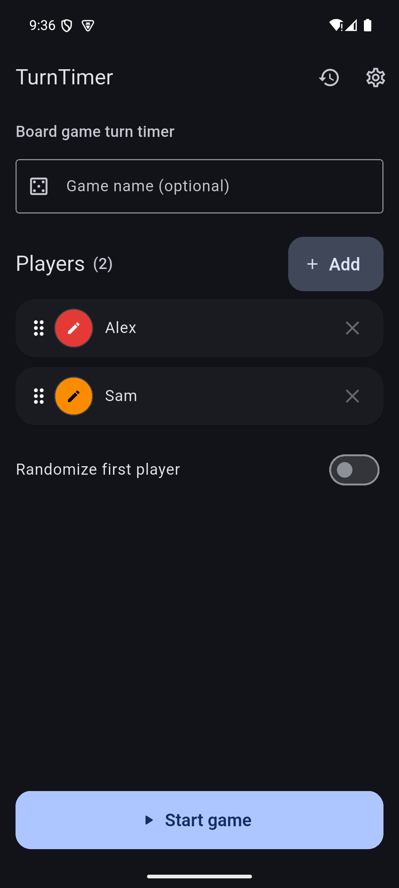
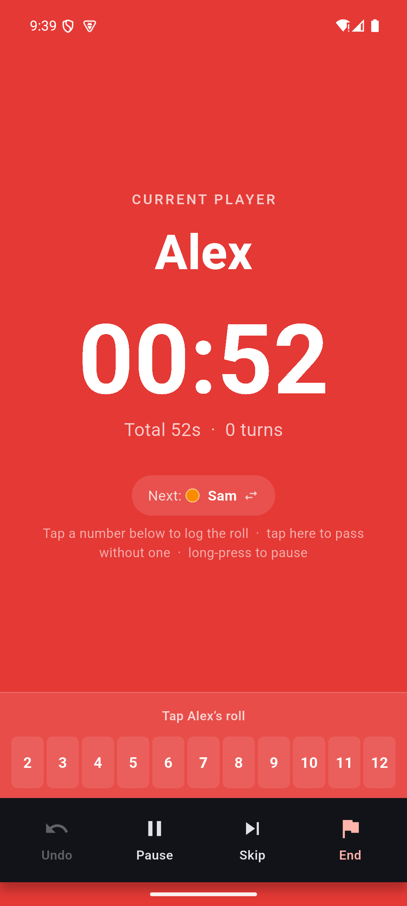
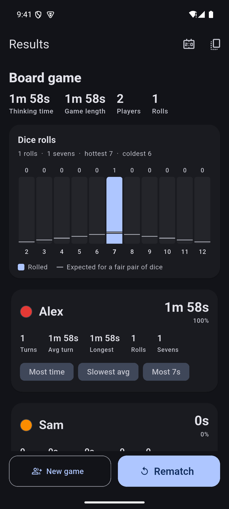

# TurnTimer — Board Game Timer

[](https://github.com/mgialousis/board_game_timer/actions/workflows/ci.yml)

TurnTimer is a Flutter app for tracking thinking time in tabletop games. The
active player's color fills the screen, one tap passes the turn, and the final
summary turns every move into useful per-player statistics.

It supports 2–8 players, optional score and dice-roll tracking, crash-safe local
persistence, game history, dark mode, and an Android lock-screen mode that keeps
long sessions usable with the display off. No account, backend, or network
connection is required.

## Preview

Real Android emulator captures using fictional players.

<p>
  
  
  
</p>

[Two-minute walkthrough](docs/WALKTHROUGH.md)

## Engineering highlights

- A pure, deterministic game engine handles timing, pause, undo, skip, and dice
  transitions independently of UI and platform code.
- Elapsed time is derived from timestamps, keeping timing consistent across
  lifecycle changes without a background counter.
- An Android foreground service exposes lock-screen actions, then replays them
  through the same Dart engine on resume.
- Defensive local persistence restores interrupted games and supports older saves.
- Unit and widget coverage includes state transitions, persistence, native-action
  reconciliation, statistics, and primary UI flows.

The app uses `ChangeNotifier` for state, `shared_preferences` for storage,
and small adapters for native behavior. See the
[implementation guide](docs/IMPLEMENTATION.md#architecture) for design tradeoffs
and the [timer model](docs/IMPLEMENTATION.md#timer-design-accurate--battery-friendly).

## Try it

Use Flutter 3.38.8 with Dart 3.10.4+, plus Android or iOS tooling.

```bash
git clone https://github.com/mgialousis/board_game_timer.git
cd board_game_timer
flutter pub get
flutter run
```

1. Choose 2–8 players, names, and colors.
2. Start the game. Tap the board to pass; long-press or use Pause to stop timing.
3. Use Undo, Skip, or the Next-player picker when turn order changes.
4. End the game, optionally enter scores, and review the statistics.
5. Open History to revisit results or replay the same lineup.

Optional dice tracking logs 2d6 rolls and shows their distribution.
Android **Locked play** provides Next and Pause/Resume on the lock screen;
iOS does not currently support that mode. Full behavior and edge cases are in
the [feature guide](docs/IMPLEMENTATION.md).

## Verify

```bash
flutter analyze
flutter test --exclude-tags golden
# Also compare the platform-sensitive icon goldens on their reference platform:
flutter test test/icon_golden_test.dart
```

CI runs analysis and 153 non-golden tests. Two icon-image comparisons are kept
separate because rendering differs across host platforms; the local suite
contains 155 tests in total. Timing tests use an injected clock, not real waits.

## Scope and next steps

This is a local-first portfolio app, not a hosted service. No accounts, API keys,
analytics, or cloud storage are needed. Player names and game history stay on the
device; signing credentials must stay outside source control.

Potential extensions include an iOS Live Activity, localization, cross-game
statistics, and a lowest-score-wins option. These are planned ideas, not shipped
features.

## Documentation

- [Product walkthrough](docs/WALKTHROUGH.md)
- [Architecture, timer model, native integration, and test map](docs/IMPLEMENTATION.md)

## License

Copyright (C) 2026 Miltiadis Gialousis.

This project's original code and content are licensed under the
[GNU Affero General Public License version 3 only](LICENSE)
(`AGPL-3.0-only`). You may use, modify, and redistribute them, including
commercially, under the license's terms. Distributed covered works must
provide corresponding source under those terms. If you modify the software
and let users interact with it remotely over a network, you must offer those
users the corresponding source of your modified version.

The software is provided without warranty. Third-party dependencies and any
separately licensed material retain their respective licenses and notices.
